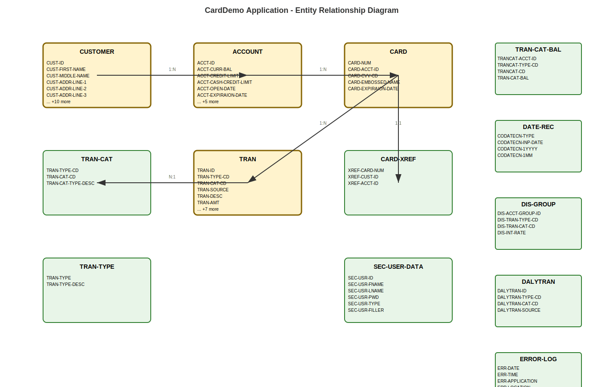

# CardDemo Application - Business Entity Analysis

## Executive Summary

This document contains the key business entities extracted from the CardDemo COBOL application. The analysis focuses on core business data structures that represent the domain model for card processing, customer management, and transaction handling.

## Core Business Entities

### Entity Summary

| Entity | Attributes Count | Description | Source File |
|--------|------------------|-------------|-------------|
| CUSTOMER-RECORD | 16 | Data-structure for Customer entity (RECLN 500) | CVCUS01Y.cpy |
| ACCOUNT-RECORD | 11 | Data-structure for  account entity (RECLN 300) | CVACT01Y.cpy |
| CARD-RECORD | 5 | Data-structure for card entity (RECLN 150) | CVACT02Y.cpy |
| TRAN-RECORD | 13 | Data-structure for TRANsaction record (RECLN = 350) | CVTRA05Y.cpy |
| CARD-XREF-RECORD | 3 | Data-structure for card xref (RECLN 50) | CVACT03Y.cpy |
| TRAN-CAT-RECORD | 3 | Data-structure for transaction category type (RECLN = 60) | CVTRA04Y.cpy |
| TRAN-TYPE-RECORD | 2 | Data-structure for transaction type (RECLN = 60) | CVTRA03Y.cpy |
| DALYTRAN-RECORD | 13 | Data-structure for DALYTRANsaction record (RECLN = 350) | CVTRA06Y.cpy |
| SEC-USER-DATA | 6 |  | CSUSR01Y.cpy |
| TRAN-CAT-BAL-RECORD | 4 | Data-structure for transaction category balance (RECLN = 50) | CVTRA01Y.cpy |
| CODATECN-REC | 22 |  | CODATECN.cpy |
| DIS-GROUP-RECORD | 4 | Data-structure for disclosure group (RECLN = 50) | CVTRA02Y.cpy |
| ERROR-LOG-RECORD | 10 |  | CCPAUERY.cpy |

### Detailed Entity Definitions

#### CUSTOMER-RECORD

*Data-structure for Customer entity (RECLN 500)*

| Attribute | Type | Level | PIC Clause | Business Purpose |
|-----------|------|-------|------------|------------------|
| CUST-ID | Integer | 5 | 9( | Unique customer identifier |
| CUST-FIRST-NAME | String | 5 | X( | Customer first name |
| CUST-MIDDLE-NAME | String | 5 | X( | Customer middle name |
| CUST-ADDR-LINE-1 | String | 5 | X( | Address information |
| CUST-ADDR-LINE-2 | String | 5 | X( | Address information |
| CUST-ADDR-LINE-3 | String | 5 | X( | Address information |
| CUST-ADDR-COUNTRY-CD | String | 5 | X( | Address information |
| CUST-ADDR-ZIP | String | 5 | X( | Address information |
| CUST-PHONE-NUM-1 | String | 5 | X( | Phone number |
| CUST-PHONE-NUM-2 | String | 5 | X( | Phone number |
| CUST-SSN | Integer | 5 | 9( | Social Security Number |
| CUST-GOVT-ISSUED-ID | String | 5 | X( | Business data field |
| CUST-DOB-YYYY-MM-DD | String | 5 | X( | Date of birth |
| CUST-EFT-ACCOUNT-ID | String | 5 | X( | Business data field |
| CUST-PRI-CARD-HOLDER-IND | String | 5 | X( | Business data field |
| CUST-FICO-CREDIT-SCORE | Integer | 5 | 9( | Credit score |

#### ACCOUNT-RECORD

*Data-structure for  account entity (RECLN 300)*

| Attribute | Type | Level | PIC Clause | Business Purpose |
|-----------|------|-------|------------|------------------|
| ACCT-ID | Integer | 5 | 9( | Unique account identifier |
| ACCT-CURR-BAL | Integer | 5 | S9( | Current account balance |
| ACCT-CREDIT-LIMIT | Integer | 5 | S9( | Credit limit |
| ACCT-CASH-CREDIT-LIMIT | Integer | 5 | S9( | Business data field |
| ACCT-OPEN-DATE | String | 5 | X( | Account opening date |
| ACCT-EXPIRAION-DATE | String | 5 | X( | Business data field |
| ACCT-REISSUE-DATE | String | 5 | X( | Business data field |
| ACCT-CURR-CYC-CREDIT | Integer | 5 | S9( | Business data field |
| ACCT-CURR-CYC-DEBIT | Integer | 5 | S9( | Business data field |
| ACCT-ADDR-ZIP | String | 5 | X( | Business data field |
| ACCT-GROUP-ID | String | 5 | X( | Business data field |

#### CARD-RECORD

*Data-structure for card entity (RECLN 150)*

| Attribute | Type | Level | PIC Clause | Business Purpose |
|-----------|------|-------|------------|------------------|
| CARD-NUM | String | 5 | X( | Credit card number |
| CARD-ACCT-ID | Integer | 5 | 9( | Unique account identifier |
| CARD-CVV-CD | Integer | 5 | 9( | Card verification value |
| CARD-EMBOSSED-NAME | String | 5 | X( | Business data field |
| CARD-EXPIRAION-DATE | String | 5 | X( | Business data field |

#### TRAN-RECORD

*Data-structure for TRANsaction record (RECLN = 350)*

| Attribute | Type | Level | PIC Clause | Business Purpose |
|-----------|------|-------|------------|------------------|
| TRAN-ID | String | 5 | X( | Unique transaction identifier |
| TRAN-TYPE-CD | String | 5 | X( | Transaction type code |
| TRAN-CAT-CD | Integer | 5 | 9( | Transaction category |
| TRAN-SOURCE | String | 5 | X( | Business data field |
| TRAN-DESC | String | 5 | X( | Transaction description |
| TRAN-AMT | Integer | 5 | S9( | Transaction amount |
| TRAN-MERCHANT-ID | Integer | 5 | 9( | Merchant information |
| TRAN-MERCHANT-NAME | String | 5 | X( | Merchant information |
| TRAN-MERCHANT-CITY | String | 5 | X( | Merchant information |
| TRAN-MERCHANT-ZIP | String | 5 | X( | Merchant information |
| TRAN-CARD-NUM | String | 5 | X( | Credit card number |
| TRAN-ORIG-TS | String | 5 | X( | Business data field |
| TRAN-PROC-TS | String | 5 | X( | Business data field |

#### CARD-XREF-RECORD

*Data-structure for card xref (RECLN 50)*

| Attribute | Type | Level | PIC Clause | Business Purpose |
|-----------|------|-------|------------|------------------|
| XREF-CARD-NUM | String | 5 | X( | Credit card number |
| XREF-CUST-ID | Integer | 5 | 9( | Unique customer identifier |
| XREF-ACCT-ID | Integer | 5 | 9( | Unique account identifier |

#### TRAN-CAT-RECORD

*Data-structure for transaction category type (RECLN = 60)*

| Attribute | Type | Level | PIC Clause | Business Purpose |
|-----------|------|-------|------------|------------------|
| TRAN-TYPE-CD | String | 10 | X( | Transaction type code |
| TRAN-CAT-CD | Integer | 10 | 9( | Transaction category |
| TRAN-CAT-TYPE-DESC | String | 5 | X( | Transaction category |

#### TRAN-TYPE-RECORD

*Data-structure for transaction type (RECLN = 60)*

| Attribute | Type | Level | PIC Clause | Business Purpose |
|-----------|------|-------|------------|------------------|
| TRAN-TYPE | String | 5 | X( | Transaction type code |
| TRAN-TYPE-DESC | String | 5 | X( | Transaction type code |

#### DALYTRAN-RECORD

*Data-structure for DALYTRANsaction record (RECLN = 350)*

| Attribute | Type | Level | PIC Clause | Business Purpose |
|-----------|------|-------|------------|------------------|
| DALYTRAN-ID | String | 5 | X( | Unique transaction identifier |
| DALYTRAN-TYPE-CD | String | 5 | X( | Transaction type code |
| DALYTRAN-CAT-CD | Integer | 5 | 9( | Transaction category |
| DALYTRAN-SOURCE | String | 5 | X( | Business data field |
| DALYTRAN-DESC | String | 5 | X( | Transaction description |
| DALYTRAN-AMT | Integer | 5 | S9( | Transaction amount |
| DALYTRAN-MERCHANT-ID | Integer | 5 | 9( | Merchant information |
| DALYTRAN-MERCHANT-NAME | String | 5 | X( | Merchant information |
| DALYTRAN-MERCHANT-CITY | String | 5 | X( | Merchant information |
| DALYTRAN-MERCHANT-ZIP | String | 5 | X( | Merchant information |
| DALYTRAN-CARD-NUM | String | 5 | X( | Credit card number |
| DALYTRAN-ORIG-TS | String | 5 | X( | Business data field |
| DALYTRAN-PROC-TS | String | 5 | X( | Business data field |

#### SEC-USER-DATA

| Attribute | Type | Level | PIC Clause | Business Purpose |
|-----------|------|-------|------------|------------------|
| SEC-USR-ID | String | 5 | X( | Business data field |
| SEC-USR-FNAME | String | 5 | X( | Business data field |
| SEC-USR-LNAME | String | 5 | X( | Business data field |
| SEC-USR-PWD | String | 5 | X( | Business data field |
| SEC-USR-TYPE | String | 5 | X( | Business data field |
| SEC-USR-FILLER | String | 5 | X( | Business data field |

#### TRAN-CAT-BAL-RECORD

*Data-structure for transaction category balance (RECLN = 50)*

| Attribute | Type | Level | PIC Clause | Business Purpose |
|-----------|------|-------|------------|------------------|
| TRANCAT-ACCT-ID | Integer | 10 | 9( | Unique account identifier |
| TRANCAT-TYPE-CD | String | 10 | X( | Business data field |
| TRANCAT-CD | Integer | 10 | 9( | Business data field |
| TRAN-CAT-BAL | Integer | 5 | S9( | Transaction category |

#### CODATECN-REC

| Attribute | Type | Level | PIC Clause | Business Purpose |
|-----------|------|-------|------------|------------------|
| CODATECN-TYPE | Unknown | 10 | X. | Business data field |
| CODATECN-INP-DATE | String | 10 | X( | Business data field |
| CODATECN-1YYYY | Unknown | 15 | XXXX. | Business data field |
| CODATECN-1MM | Unknown | 15 | XX. | Business data field |
| CODATECN-1DD | Unknown | 15 | XX. | Business data field |
| CODATECN-1FIL | String | 15 | X( | Business data field |
| CODATECN-1O-YYYY | Unknown | 15 | XXXX. | Business data field |
| CODATECN-1I-S1 | Unknown | 15 | X. | Business data field |
| CODATECN-1MM | Unknown | 15 | XX. | Business data field |
| CODATECN-1I-S2 | Unknown | 15 | X. | Business data field |
| CODATECN-2YY | Unknown | 15 | XX. | Business data field |
| CODATECN-2FIL | String | 15 | X( | Business data field |
| CODATECN-OUTTYPE | Unknown | 10 | X. | Business data field |
| CODATECN-0UT-DATE | String | 10 | X( | Business data field |
| CODATECN-1O-YYYY | Unknown | 15 | XXXX. | Business data field |
| CODATECN-1O-S1 | Unknown | 15 | X. | Business data field |
| CODATECN-1O-MM | Unknown | 15 | XX. | Business data field |
| CODATECN-1O-S2 | Unknown | 15 | X. | Business data field |
| CODATECN-1O-DD | Unknown | 15 | XX. | Business data field |
| CODATECN-2O-YYYY | Unknown | 15 | XXXX. | Business data field |
| CODATECN-2O-MM | Unknown | 15 | XX. | Business data field |
| CODATECN-2O-DD | Unknown | 15 | XX. | Business data field |

#### DIS-GROUP-RECORD

*Data-structure for disclosure group (RECLN = 50)*

| Attribute | Type | Level | PIC Clause | Business Purpose |
|-----------|------|-------|------------|------------------|
| DIS-ACCT-GROUP-ID | String | 10 | X( | Business data field |
| DIS-TRAN-TYPE-CD | String | 10 | X( | Transaction type code |
| DIS-TRAN-CAT-CD | Integer | 10 | 9( | Transaction category |
| DIS-INT-RATE | Integer | 5 | S9( | Business data field |

#### ERROR-LOG-RECORD

| Attribute | Type | Level | PIC Clause | Business Purpose |
|-----------|------|-------|------------|------------------|
| ERR-DATE | String | 5 | X( | Business data field |
| ERR-TIME | String | 5 | X( | Business data field |
| ERR-APPLICATION | String | 5 | X( | Business data field |
| ERR-LOCATION | String | 5 | X( | Business data field |
| ERR-LEVEL | String | 5 | X( | Business data field |
| ERR-SUBSYSTEM | String | 5 | X( | Business data field |
| ERR-CODE-1 | String | 5 | X( | Business data field |
| ERR-CODE-2 | String | 5 | X( | Business data field |
| ERR-MESSAGE | String | 5 | X( | Business data field |
| ERR-EVENT-KEY | String | 5 | X( | Business data field |

## Entity Relationships

The following relationships have been identified between entities:

| From Entity | To Entity | Relationship Type | Foreign Key Field | Cardinality |
|-------------|-----------|-------------------|-------------------|-------------|
| CUSTOMER-RECORD | CUSTOMER-RECORD | references | CUST-ID | N:1 |
| CARD-XREF-RECORD | CARD-RECORD | references | XREF-CARD-NUM | N:1 |
| DALYTRAN-RECORD | CARD-RECORD | references | DALYTRAN-CARD-NUM | N:1 |
| CARD-RECORD | CARD-RECORD | references | CARD-NUM | N:1 |
| ACCOUNT-RECORD | ACCOUNT-RECORD | references | ACCT-ID | N:1 |
| TRAN-RECORD | CARD-RECORD | references | TRAN-CARD-NUM | N:1 |

### Business Relationship Description

- **Customer → Account**: A customer can have multiple accounts (1:N)
- **Account → Card**: An account can have multiple cards (1:N)
- **Card → Transaction**: A card can have multiple transactions (1:N)
- **Transaction → Category**: Transactions are categorized by type and category codes
- **Customer → Transaction**: Implicit relationship through Account and Card entities

## Entity Relationship Diagram

## Notes

- All monetary fields use COBOL packed decimal format (PIC S9(n)V99)
- Date fields are stored as strings in YYYY-MM-DD format
- ID fields are typically 9-16 digit numeric identifiers
- The application uses VSAM file organization for data storage
